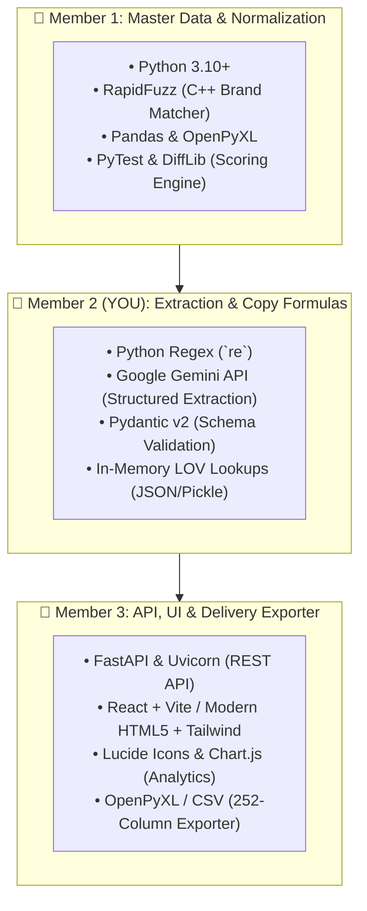
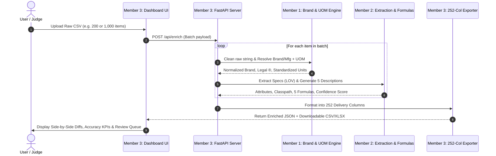

# 🚀 FuMA: Master Architecture, Tech Stack & 3-Day Execution Blueprint
> **FuMA — From Messy Feeds to Master-Class Catalogs.**  
> *An AI-assisted, rule-governed industrial product catalog enrichment & normalization engine.*

---

## 📌 1. Project Overview & Core Mission

Industrial distributors receive raw catalog data from hundreds of suppliers that is cryptic, non-standardized, and incomplete (e.g. `3/8 CPLG BRS 150#`, `PDSH4816AF Dishwasher SS - Display Only`).

**FuMA** transforms messy raw supplier feeds into **fully standardized, search-ready, 252-column product records** that strictly adhere to client content guidelines, approved List of Values (LOV), master UOM standards, and multichannel description formulas.

---

## 🛠️ 2. Complete Tech Stack Details by Team Member



### Detailed Responsibility & Tooling Matrix:

| Member | Focus Area | Tech & Libraries | Key Deliverables |
| :--- | :--- | :--- | :--- |
| **👤 Member 1** | **Master Data & Rules** | `rapidfuzz`, `pandas`, `openpyxl`, `pytest` | • Fuzzy brand/mfg resolver matching against 27k list with legal `®`/`™` symbols.<br/>• Decimal-to-fraction converter (`50.25` $\rightarrow$ `50-1/4 in`).<br/>• Standard UOM spacing rules (`24 in`, `120 V`, `47 dBA`).<br/>• Automated scoring benchmark script against the 200 ground-truth rows. |
| **👤 Member 2 (YOU)** | **AI Extraction & Formulas** | `re`, `google-genai`, `pydantic`, `json` | • Taxonomy classifier (`Classpath` & `UNSPSC`).<br/>• LOV-constrained spec extractor for target categories (Faucets & Fittings).<br/>• 5 mathematical description formula generators (Invoice $\le 40$ CAPS, Mobile $60-80$, Short Title, Long, Retail). |
| **👤 Member 3** | **API, UI & Delivery** | `fastapi`, `uvicorn`, `react` / `html-tailwind`, `chart.js` | • FastAPI backend pipeline orchestration.<br/>• Interactive dashboard with side-by-side diff viewer.<br/>• "Needs Human Review" exception queue.<br/>• 252-column CSV/Excel export builder. |

#### 📦 Universal Team Install Command
```bash
pip install fastapi uvicorn pandas openpyxl rapidfuzz pydantic google-genai pytest
```

---

## 🏗️ 3. System Architecture & End-to-End Flow



---

## 📜 4. The Shared Data Contract (`fuma_core/schema.py`)

All three members adhere to this shared schema to prevent merge conflicts and broken interfaces:

```python
from pydantic import BaseModel, Field
from typing import Dict, List, Optional

class AttributeItem(BaseModel):
    label: str
    value: str
    uom: Optional[str] = ""

class ProductRecord(BaseModel):
    # Ingested & Member 1 Output
    mfg_part_num: str
    part_desc_raw: str
    manufacturer_name: str
    brand_name: str
    series: Optional[str] = ""
    
    # Member 2 Output (YOU)
    classpath: str
    unspsc: Optional[str] = ""
    product_name: str
    attributes: List[AttributeItem] = []
    features: List[str] = []
    
    # 5 Multichannel Descriptions (Strict Formulas & Constraints)
    invoice_desc: str = Field(..., max_length=40)  # Must be <= 40 chars, ALL CAPS
    mobile_desc: str = Field(..., max_length=80)   # Target: 60-80 chars
    short_desc: str                                # Brand + Series + MPN + Type + Key Specs
    long_desc1: str                                # Full spec chain in standard sequence
    retail_desc: str                               # Marketing highlights
    
    # Validation & Quality Flags
    confidence_score: float = 100.0                # 0 - 100%
    needs_review: bool = False
    review_reasons: List[str] = []
```

---

## 📅 5. 3-Day Action Timeline (Aug 20 – Aug 23)

```mermaid
gantt
    title FuMA 3-Day Hackathon Schedule
    dateFormat  YYYY-MM-DD
    section Day 1: Foundation
    Inspect Reference Files & Ground Truth Diff :2026-08-20, 1d
    Pydantic Schema & FastAPI Skeleton :2026-08-20, 1d
    section Day 2: Core Engines
    Member 1: Brand Matcher & UOM Converter :2026-08-21, 1d
    Member 2: LOV Extractor & 5 Formulas (Faucets/Fittings) :2026-08-21, 1d
    Member 3: Dashboard UI & 252-Col Exporter :2026-08-21, 1d
    section Day 3: Scale, Score & Demo
    Run 1,000 Items & Review Queue :2026-08-22, 1d
    Accuracy Scorecard & Video Demo Pitch :2026-08-22, 1d
```

### 🗓️ Day 1: Foundation + Ground Truth Lock (Aug 20–21)
* **All Members:** Lock the 252-column data model (`fuma_core/schema.py`).
* **Member 1:** Parse the 7 reference files (Brand master list, UOM table, Decimal-Fraction table) into fast in-memory lookups.
* **Member 2 (YOU):** Deep dive into `FAUCETS_LOV.xlsx` and `Fittings_LOV.xlsx`; trace 10 rows from the 200 ground-truth items to establish exact formula logic.
* **Member 3:** Stand up the FastAPI skeleton and initial dashboard UI wireframe.

### 🗓️ Day 2: Core Engines & Deep Compliance (Aug 21–22)
* **Member 1:** Build the fuzzy brand matcher (with `®`/`™`) and unit standardizer; benchmark against all 200 ground-truth rows.
* **Member 2 (YOU):** Build the attribute extractor and 5 description formula generators for **Faucets & Fittings** to achieve near-100% compliance.
* **Member 3:** Connect the dashboard to the real pipeline; render live side-by-side diffs (Input vs. AI Generated vs. Ground Truth).

### 🗓️ Day 3: Scale, Score & Pitch Polish (Aug 22–23)
* **Morning:** Run the full 1,000-item dataset through FuMA.
* **Afternoon:** Build the **Accuracy & Compliance Scorecard** (LOV Match %, Char Limit Pass %, Field Accuracy %) and the **"Needs Human Review" Queue** for ambiguous rows.
* **Evening:** Record the 3-minute video demo, prepare presentation slides showcasing **depth over breadth**, and submit!

---

## 🎯 6. Key Principles to Win

1. **Depth Beats Breadth:** Perfect compliance in Faucets & Fittings proves the architecture works end-to-end.
2. **Constrained, Not Creative:** Every attribute value must come from the official LOV; invented values score zero.
3. **Strict Character Limits:** `INVOICE_DESC` $\le 40$ chars (ALL CAPS) and `MOBILE_DESC` $60-80$ chars.
4. **Honest Review Queue:** Low-confidence rows are flagged for human review, turning data gaps into an enterprise feature.
