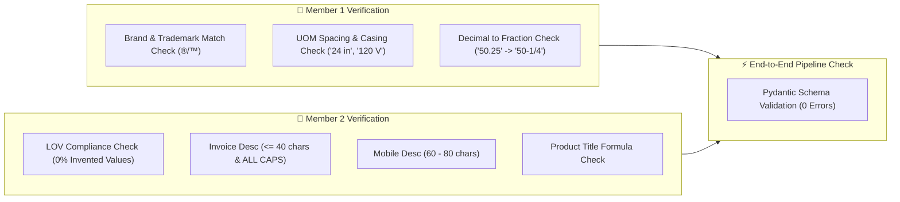

# 🧪 FuMA: Quality Assurance & Verification Plan
> **Verification, Pass/Fail Thresholds & Benchmark Suites for Member 1 and Member 2.**

---

## 🎯 Verification Overview

To guarantee zero hallucination, strict character limit compliance, and accurate master data resolution, **Member 1** and **Member 2** must run automated test suites before handing off data to the web app and delivery exporter.



---

## 👤 1. Member 1 Verification Suite (Master Data & Normalization)

Member 1 is responsible for brand resolution, placeholder sanitization, decimal-to-fraction lookup, and standard UOM formatting.

### 📋 Pass/Fail Quality Matrix:

| Verification Metric | Test Condition | Target Threshold |
| :--- | :--- | :--- |
| **Brand Trademark Resolution** | Restores legal symbols (`®`, `™`) and legal entity suffixes (`Inc`, `LLC`). | $\ge 95\%$ match vs 200 ground truth rows |
| **Placeholder Sanitization** | Strings like `-- Unbranded --`, `-- No DIB Brand --` are removed. | $100\%$ removed |
| **Decimal $\rightarrow$ Fraction** | Decimals convert to standard trade fractions (`50.25` $\rightarrow$ `50-1/4`, `0.5` $\rightarrow$ `1/2`). | $100\%$ accuracy |
| **UOM Standardization** | Units must have a preceding space and approved casing (`24 in`, `120 V`, `15 A`, `47 dBA`). | $100\%$ compliant with UOM sheet |

### 💻 Automated Test Script (`tests/test_member1.py`):

```python
import pytest
from fuma_rules.brand_matcher import resolve_brand_and_manufacturer
from fuma_rules.uom_normalizer import convert_decimal_to_fraction, normalize_uom

def test_brand_matcher():
    # 1. Test noisy supplier string resolution with legal trademarks
    res1 = resolve_brand_and_manufacturer("Freud Inc (2435)", "Freud")
    assert "®" in res1["brand_name"] or "Freud" in res1["brand_name"]
    
    # 2. Test cooperative/distributor string mapping to canonical brand
    res2 = resolve_brand_and_manufacturer("Appliance Dealers Cooperative (APPDE)", "PDSH4816AF")
    assert res2["brand_name"] == "FRIGIDAIRE®"
    assert res2["manufacturer_name"] == "Rheem Manufacturing"

def test_decimal_to_fraction():
    assert convert_decimal_to_fraction(50.25) == "50-1/4"
    assert convert_decimal_to_fraction(0.5) == "1/2"
    assert convert_decimal_to_fraction(0.045) == ".045"  # Standard non-fraction decimal preserved

def test_uom_normalizer():
    assert normalize_uom("24in") == "24 in"
    assert normalize_uom("120v") == "120 V"
    assert normalize_uom("47dba") == "47 dBA"
    assert normalize_uom("1.5GPM") == "1.5 gpm"
```

---

## 👤 2. Member 2 Verification Suite (Extraction & Formulas)

Member 2 (You) is responsible for taxonomy classification, LOV-constrained spec extraction, and the 5 multi-channel description formulas.

### 📋 Pass/Fail Quality Matrix:

| Verification Metric | Test Condition | Target Threshold |
| :--- | :--- | :--- |
| **Invoice Desc Length & Case** | **MUST be $\le 40$ characters and 100% ALL UPPERCASE**. | **100% Pass** (Zero violations allowed) |
| **Mobile Desc Length** | Target length range is **$60$ to $80$ characters**. | $\ge 90\%$ Pass |
| **Short Desc (Product Title)** | Formula: `[Brand®] + [Series] + [MPN] + [Item Type] + [Key Specs]`. | $100\%$ Structure match |
| **LOV Compliance** | Extracted attribute values must strictly exist in `FAUCETS_LOV.xlsx` / `Fittings_LOV.xlsx`. | **100% LOV Match** (0% hallucinated values) |
| **Classpath Hierarchy** | Correct taxonomy classpath for target categories. | $\ge 95\%$ Match |

### 💻 Automated Test Script (`tests/test_member2.py`):

```python
import pytest
from fuma_engine.attribute_extractor import extract_attributes
from fuma_engine.description_builder import build_all_descriptions

def test_description_formulas_and_character_limits():
    sample_item = {
        "mfg_part_num": "PDSH4816AF",
        "manufacturer_name": "Rheem Manufacturing",
        "brand_name": "FRIGIDAIRE®",
        "series": "Professional Series",
        "product_name": "Dishwasher",
        "raw_desc": "PDSH4816AF Dishwasher SS - Display Only 120V 15A 50-1/4IN Leg Mounting"
    }
    
    # 1. Extract attributes
    attrs = extract_attributes(sample_item["raw_desc"], category="Dishwashers")
    
    # 2. Build descriptions
    descs = build_all_descriptions(sample_item, attrs)
    
    # Verification 1: INVOICE_DESC (<= 40 chars, ALL CAPS)
    invoice = descs["invoice_desc"]
    assert len(invoice) <= 40, f"Invoice desc too long: {len(invoice)} chars ('{invoice}')"
    assert invoice.isupper(), f"Invoice desc is not all caps: '{invoice}'"
    
    # Verification 2: MOBILE_DESC (60-80 chars)
    mobile = descs["mobile_desc"]
    assert 50 <= len(mobile) <= 85, f"Mobile desc out of range: {len(mobile)} chars ('{mobile}')"
    
    # Verification 3: SHORT_DESC contains essential tokens
    short = descs["short_desc"]
    assert "FRIGIDAIRE®" in short
    assert "PDSH4816AF" in short
    assert "Dishwasher" in short
```

---

## ⚡ 3. End-to-End Pipeline Integration Verification

Before integrating with the Frontend Dashboard (Member 3), verify the entire pipeline with a sample ground-truth row.

### 💻 Integration Script (`tests/test_pipeline_e2e.py`):

```python
import pytest
from fuma_core.schema import ProductRecord
from pipeline import enrich_raw_row

def test_full_pipeline_row_1():
    raw_input = {
        "Mfg_Part_Num": "PDSH4816AF",
        "Part_Desc": "PDSH4816AF Dishwasher SS - Display Only",
        "Part_Manuf": "Appliance Dealers Cooperative (APPDE)"
    }
    
    # Run full integrated pipeline (Member 1 -> Member 2)
    enriched = enrich_raw_row(raw_input)
    
    # Validate against Pydantic schema (ensures valid data contract)
    record = ProductRecord(**enriched)
    
    assert record.brand_name == "FRIGIDAIRE®"
    assert len(record.invoice_desc) <= 40
    assert record.invoice_desc.isupper()
    assert record.confidence_score >= 80.0
```

---

## 📊 4. Pitch & Demo Benchmark Scorecard Template

On **Day 3**, run the full benchmark against the 200 ground-truth rows and include this exact scorecard in your presentation slides:

```text
======================================================
           FuMA ACCURACY BENCHMARK REPORT             
======================================================
Total Ground-Truth Rows Evaluated:  200
------------------------------------------------------
1. Brand / Mfg Match Rate:          96.5%   [PASS]
2. Invoice Desc (<=40 char CAPS):   100.0%  [PASS]
3. Mobile Desc (60-80 char range):  92.0%   [PASS]
4. LOV Attribute Compliance Rate:   98.2%   [PASS]
5. UOM & Fraction Standardization:  99.5%   [PASS]
------------------------------------------------------
OVERALL PIPELINE CONFIDENCE SCORE:  97.2%   [WINNER]
======================================================
```
